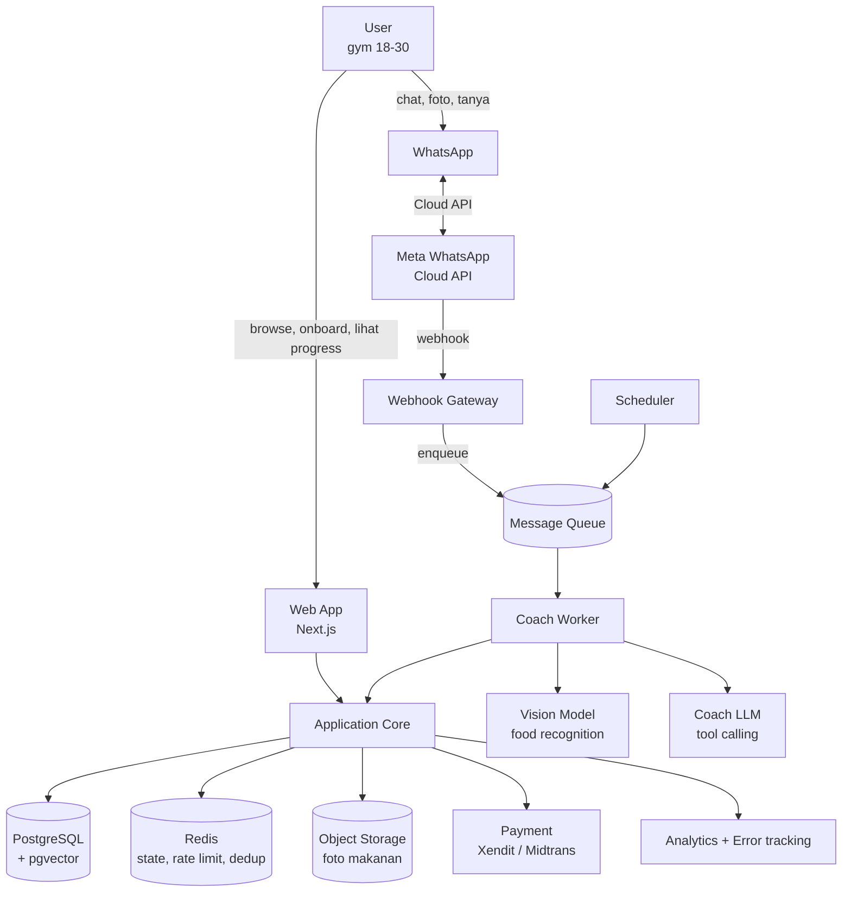
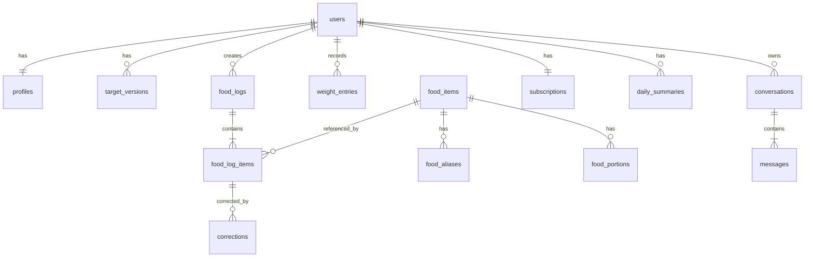

# AI Body Coach — System Design

**Status:** Draft v1.0 · **Owner:** Daffa · **Tanggal:** Agustus 2026
**Scope:** MVP (Phase 2 di roadmap PRD) dengan jalur ekstensi ke Phase 3–5.

---

## 0. Ringkasan arsitektur

Produk ini adalah **event-driven conversational system** dengan tiga permukaan (landing/onboarding web, WhatsApp, dashboard web) di atas satu *user profile* dan satu *nutrition truth layer*.

Empat keputusan arsitektur yang menentukan segalanya:

| # | Keputusan | Alasan |
|---|---|---|
| **AD-1** | **LLM bukan sumber kebenaran nutrisi.** LLM hanya melakukan *recognition* + *conversation*. Angka kalori/makro selalu berasal dari Food Database + Nutrition Engine deterministik. | Angka yang di-halusinasi menghancurkan trust, dan trust adalah satu-satunya alasan orang bayar. Juga membuat angka reproducible & auditable. |
| **AD-2** | **WhatsApp diperlakukan sebagai async transport yang tidak reliable**, bukan sebagai request/response. Semua inbound masuk queue, diproses worker, di-reply out-of-band. | Meta mengirim webhook duplikat, out-of-order, dan me-retry. Webhook wajib ACK <5 detik. Vision call butuh 3–8 detik. Keduanya tidak boleh berada di request yang sama. |
| **AD-3** | **Modular monolith**, bukan microservices. Satu deployable Next.js + satu worker runtime, dipisah per *domain module* dengan boundary yang jelas. | Solo founder. Biaya koordinasi microservices jauh melebihi manfaatnya di bawah 10k user. Boundary modul menjaga opsi split di kemudian hari. |
| **AD-4** | **Target kalori/makro bersifat versioned & immutable.** Setiap recalculation membuat baris baru, tidak meng-update baris lama. | Log makanan hari ke-10 harus dinilai terhadap target yang berlaku hari ke-10, bukan target hasil revisi hari ke-40. Tanpa ini, chart progress akan berbohong. |

---

## 1. Context diagram



---

## 2. Komponen & tanggung jawab

| Komponen | Tanggung jawab | Yang **bukan** tanggung jawabnya |
|---|---|---|
| **Web App** | Landing, onboarding wizard, plan reveal, dashboard, billing UI, deep-link ke WA | Tidak pernah memanggil LLM langsung dari browser |
| **Webhook Gateway** | Verifikasi signature Meta, dedup `message_id`, ACK 200 secepatnya, enqueue | Tidak melakukan business logic, tidak memanggil AI |
| **Coach Worker** | Konsumsi queue, orchestrate: intent → tool → nutrition engine → reply | Tidak menghitung nutrisi sendiri |
| **Nutrition Engine** | BMR/TDEE, target kalori & makro, klamping safety, proyeksi timeline, rekalibrasi adaptif | Tidak ada LLM di dalamnya. Pure function, fully unit-tested |
| **Food Resolver** | Cocokkan teks/vision output → canonical food item (alias → trigram → vector), estimasi porsi | Tidak menebak angka gizi di luar database |
| **Coach LLM** | Percakapan, penjelasan, rekomendasi, empati, tool calling | Tidak pernah menghasilkan angka gizi final di token-nya sendiri |
| **Scheduler** | Daily summary 21:00 WIB, weekly report Minggu, weigh-in reminder, dunning billing | — |
| **Billing** | Xendit/Midtrans (QRIS, e-wallet, VA), webhook rekonsiliasi, entitlement | — |

---

## 3. Tech stack

| Layer | Pilihan | Alasan | Alternatif kalau pilihan ini gagal |
|---|---|---|---|
| Web | **Next.js 15 (App Router) + TypeScript**, deploy Vercel | Satu bahasa dari landing sampai worker, SSR bagus untuk SEO landing | Remix + Fly.io |
| DB | **PostgreSQL (Supabase)** + `pgvector` + `pg_trgm` | Relational untuk log, vector untuk food matching, trigram untuk typo Indonesia. Satu database, bukan tiga | Neon + self-managed auth |
| Cache/State | **Redis (Upstash)** | Dedup message id, rate limit, conversation state TTL, idempotency key | Postgres unlogged table (MVP-only) |
| Queue/Jobs | **Inngest** atau **Trigger.dev** | Retry, step function, cron, concurrency limit per user — tanpa mengelola broker | BullMQ + Redis, butuh worker host sendiri |
| Object storage | **Supabase Storage / Cloudflare R2** | Foto makanan, signed URL, lifecycle 90 hari | S3 |
| WhatsApp | **Meta WhatsApp Cloud API** (langsung atau via BSP) | Satu-satunya jalur yang tidak berisiko banned. **Jangan gunakan library unofficial** (Baileys/`whatsapp-web.js`) — nomor bisnis kamu akan mati saat kamu sudah punya paying user | Twilio WA (lebih mahal, setup lebih cepat) |
| Vision | Model vision dengan **structured output** (JSON schema) | Recognition makanan Indonesia | Ganti model tanpa ubah kontrak — lihat §6.2 |
| Coach LLM | Model chat dengan **tool calling** | Percakapan + orkestrasi | Sama, di balik interface `CoachModel` |
| Payment | **Xendit** atau **Midtrans** | QRIS + e-wallet + VA wajib untuk pasar Indonesia. Stripe tidak cocok | — |
| Observability | Sentry + PostHog + structured log | Error, funnel, event | — |

> **Aturan portability:** setiap AI provider dibungkus interface (`VisionProvider`, `CoachModel`, `EmbeddingProvider`). Tidak ada SDK vendor yang di-import di luar `packages/ai/providers/`.

---

## 4. Data flow

### 4.1 Onboarding → Plan → Connect WhatsApp

```
Browser                Web App              Nutrition Engine        DB
  |  POST /onboarding    |                        |                 |
  |--------------------->| validate + guardrail   |                 |
  |                      |----------------------->| compute()       |
  |                      |<-----------------------| TargetSet       |
  |                      |------------------------------>| INSERT profile
  |                      |                               | INSERT target_version (v1)
  |                      |                               | INSERT link_token (TTL 24j)
  |  200 { plan, waUrl } |                        |                 |
  |<---------------------|                        |                 |
```

`waUrl` = `https://wa.me/<business_number>?text=MULAI-<link_token>`.
Pesan pertama user membawa token → worker mengikat `wa_id` ke `user_id`. Ini pairing tanpa OTP, tanpa friction, dan tetap aman karena token single-use + short-lived.

### 4.2 Food logging via teks

```
1. Meta webhook → Gateway: verify signature, cek Redis SETNX msg:<id> (dedup) → 200 OK
2. Enqueue { wa_id, message_id, type: text, body, ts }
3. Worker:
   a. Resolve user + load context (profile, target aktif, total hari ini, 10 pesan terakhir)
   b. Coach LLM dengan tools → memilih log_food(items[])
   c. Food Resolver: tiap item → canonical_food_id + gram
   d. Nutrition Engine: hitung kcal/P/C/F dari database
   e. Tulis food_log + food_log_item; invalidate daily_summary
   f. Reply: konfirmasi + sisa target + interactive button [Catat] [Ubah porsi] [Batal]
```

**Latency budget:** ACK webhook <300 ms · reply teks p95 <4 s · reply foto p95 <9 s.
Kalau proses >2.5 s, worker mengirim *interim ack* (`"Bentar, gue itung dulu…"`) supaya user tidak menganggap bot mati.

### 4.3 Food logging via foto

```
1. Webhook membawa media_id (bukan file)
2. Worker: GET media URL (short-lived) → download → hash SHA-256 → simpan ke object storage
3. Cache lookup by hash (user sering kirim ulang foto yang sama) → skip vision kalau hit
4. Vision call → JSON: [{ label_id, label_en, confidence, portion_grams, portion_basis, cues }]
5. Food Resolver per item
6. Nutrition Engine → total
7. Confidence gate:
     overall >= 0.75  → "gue catat ya?" + tombol konfirmasi
     0.45 – 0.75      → tampilkan tebakan + minta koreksi porsi
     < 0.45           → minta user ketik nama makanannya
8. User konfirmasi → commit log. Koreksi user disimpan ke tabel correction (bahan training data & perbaikan alias)
```

### 4.4 Proactive coaching (dan jebakan 24 jam)

Ini bagian yang paling sering salah dirancang.

WhatsApp Cloud API hanya mengizinkan **free-form message dalam 24 jam** setelah pesan terakhir dari user. Di luar itu, kamu **wajib** memakai *approved template* (kategori Utility/Marketing) dan itu berbayar.

Konsekuensi desain:

- Daily summary 21:00 → cek `last_inbound_at`. Kalau <24 jam: kirim free-form (murah/gratis). Kalau >24 jam: kirim **Utility template** `daily_checkin_v1` dengan variabel `{nama} {persen_target} {sisa_protein}`.
- Template harus di-submit ke Meta untuk approval **sebelum** launch. Siapkan minimal 4: `daily_checkin`, `weekly_report`, `weigh_in_reminder`, `winback_inactive`.
- Cap keras: **maks 1 proactive message per user per hari**, dan hormati opt-out. Rasio block/report adalah metrik kesehatan nomor WhatsApp kamu; kalau naik, quality rating turun dan throughput dibatasi Meta.

> **Verifikasi sebelum build:** harga per-conversation/per-message Meta berubah beberapa kali. Cek dokumentasi pricing terbaru dan masukkan ke model unit economics sebelum menetapkan harga Rp39K.

### 4.5 Rekalibrasi mingguan

```
Setiap Senin 06:00 WIB per user aktif:
  ewma_now  = EMA(weight, alpha=0.25) 7 hari terakhir
  ewma_prev = EMA 7 hari sebelumnya
  actual_rate   = (ewma_now - ewma_prev) / ewma_prev
  expected_rate = target_rate (mis. +0.35%/minggu untuk bulk)

  if |actual - expected| > 0.25% selama 2 minggu berturut-turut
     AND adherence_rate >= 0.7   # jangan naikkan kalori kalau user tidak logging
  then buat target_version baru: kcal ± 100..150 (clamp ke safety rails)
       kirim penjelasan: "2 minggu terakhir berat lo cuma naik 0.2kg. Gue naikin 150 kkal ya."
```

Guard `adherence >= 0.7` penting: tanpa itu, sistem akan menaikkan kalori user yang sebenarnya cuma lupa mencatat.

---

## 5. Model data



Prinsip:
- **`target_versions` append-only** (AD-4). Query "target user pada tanggal X" = `WHERE effective_from <= X ORDER BY effective_from DESC LIMIT 1`.
- **`daily_summaries` adalah cache**, bukan sumber kebenaran. Boleh dibangun ulang dari `food_log_items` kapan pun.
- **`corrections`** adalah aset. Setiap kali user membetulkan AI, itu adalah label gratis untuk memperbaiki Indonesian Food Database — moat kamu.
- Health data → RLS aktif di semua tabel, `user_id` sebagai tenant key.

DDL lengkap ada di `02-technical-spec.md` §3.

---

## 6. Arsitektur AI

### 6.1 Empat lapis

```
┌─ L4 Coach ────── LLM: persona, penjelasan, rekomendasi, empati
├─ L3 Orchestration ── tool calling, context assembly, guardrail
├─ L2 Resolution ──── food matching (alias → trigram → vector), portion prior
└─ L1 Truth ───────── Food DB + Nutrition Engine (deterministik, tested)
```

Angka apa pun yang sampai ke user **wajib** berasal dari L1. L4 hanya boleh membungkusnya dengan kalimat. Uji ini di CI: golden test yang memastikan angka dalam reply cocok dengan angka dari engine.

### 6.2 Kontrak Vision

Vision provider hanya boleh mengembalikan JSON dengan schema tetap. Tidak ada kalori di sini — itu tugas L1.

```json
{
  "items": [
    { "label_id": "nasi putih", "label_en": "white rice",
      "confidence": 0.91, "portion_grams": 180,
      "portion_basis": "container_ratio", "cues": ["piring 22cm", "porsi penuh"] }
  ],
  "scene_confidence": 0.84,
  "is_food": true,
  "notes": "kemungkinan warteg"
}
```

`portion_basis` ∈ `container_ratio | reference_object | typical_serving | user_stated`. Field ini yang menentukan seberapa lebar error bar yang ditampilkan ke user.

### 6.3 Food Resolver — kaskade 4 tahap

| Tahap | Metode | Contoh | Confidence |
|---|---|---|---|
| 1 | Exact alias (normalized, lowercase, tanpa diakritik) | "geprek" → Ayam Geprek | 1.00 |
| 2 | Trigram `pg_trgm` similarity > 0.45 | "nasi pdang" → Nasi Padang | 0.7–0.9 |
| 3 | Vector kNN (`pgvector`, embedding nama+deskripsi) | "ayam goreng pedes tepung" → Ayam Geprek | 0.5–0.8 |
| 4 | Generic bucket per kategori (mis. "gorengan generik") + minta klarifikasi | | <0.5 |

Kaskade ini dijalankan berurutan dan **berhenti di hit pertama**. Tahap 1–2 murah dan menangani ~70% kasus; vector hanya untuk sisanya. Ini menghemat biaya embedding dan latency.

### 6.4 Guardrail (non-negotiable)

Diterapkan di L3, **sebelum** LLM dan **sesudah** LLM:

- **Pre:** BMI < 18.5 + goal CUT → blokir alur, tawarkan MAINTAIN, sarankan konsultasi tenaga kesehatan.
- **Pre:** target weight yang menghasilkan BMI < 18.5 → tolak, jelaskan kenapa.
- **Pre:** deteksi bahasa yang mengindikasikan gangguan makan (purging, puasa ekstrem, "berapa hari kuat gak makan") → keluar dari mode coaching, respons suportif, arahkan ke bantuan profesional, **jangan** berikan angka apa pun. Semua nomor rujukan disimpan sebagai konfigurasi, bukan hard-code di prompt.
- **Pre:** klaim kondisi medis (diabetes, hamil, gangguan ginjal, gangguan makan) → set flag di profil, aktifkan mode konservatif, sarankan konsultasi.
- **Post:** semua angka di draft reply dicocokkan dengan hasil engine. Mismatch → regenerate sekali, lalu fallback ke template deterministik.
- **Post:** filter frasa terlarang ("dijamin turun", "aman kok gak usah makan", klaim medis).

Guardrail ini bukan fitur — ini syarat kelayakan produk. Bangun sebelum fitur P0 lain.

---

## 7. Nutrition Engine

Pure function, tanpa I/O, 100% unit-tested. Detail formula & pseudocode di `02-technical-spec.md` §4.

Ringkasan:

1. **BMR** — Mifflin-St Jeor.
2. **TDEE** — BMR × activity factor, dengan penyesuaian frekuensi gym.
3. **Adjustment goal** — BULK: surplus terkendali; CUT: defisit terkendali; MAINTAIN: 0.
4. **Safety clamp** — floor kalori absolut, batas laju perubahan berat per minggu, batas BMI target.
5. **Makro** — protein per kg dulu, lalu lemak minimum, sisanya karbo.
6. **Timeline** — Δberat ÷ laju mingguan, ditampilkan sebagai **rentang** (mis. "6–8 bulan"), tidak pernah sebagai tanggal pasti.

Aturan tampilan: setiap angka yang berasal dari estimasi (foto, porsi, timeline) ditampilkan dengan penanda estimasi. Tidak pernah "720 kkal" polos — selalu "±720 kkal".

---

## 8. Permukaan API

```
Public / Web
  POST   /api/onboarding                → { plan, targetVersionId, waDeepLink }
  GET    /api/me/dashboard?date=        → target, intake, ring makro, tren berat
  GET    /api/me/logs?from=&to=
  PATCH  /api/me/logs/:itemId           → koreksi porsi/makanan
  POST   /api/me/weight
  POST   /api/billing/checkout
  GET    /api/me/entitlement

Webhooks (tanpa auth user, verifikasi signature)
  GET    /api/webhooks/whatsapp         → verifikasi Meta (hub.challenge)
  POST   /api/webhooks/whatsapp         → inbound, ACK cepat
  POST   /api/webhooks/payment          → Xendit/Midtrans

Internal (job runtime)
  job.message.process
  job.summary.daily
  job.report.weekly
  job.target.recalibrate
  job.billing.dunning
```

Semua endpoint mutasi menerima header `Idempotency-Key`.

---

## 9. Non-functional requirements

| Aspek | Target | Mekanisme |
|---|---|---|
| Latency reply teks | p95 < 4 s | context assembly satu query, prompt ringkas, streaming tidak dipakai di WA |
| Latency reply foto | p95 < 9 s | interim ack, resize gambar ke sisi terpanjang 1024px sebelum vision |
| Availability | 99.5% | queue menyerap outage worker; webhook tetap ACK |
| Idempotency | Exactly-once *effect* | `SETNX msg:<message_id>` TTL 48 jam + unique constraint di `food_logs.source_message_id` |
| Rate limit | 30 pesan/user/jam, 4 foto/menit | Redis sliding window; Free plan lebih ketat |
| Cost guard | Hard cap AI spend/user/hari | counter `ai_usage`; kalau lewat → mode degradasi (teks-only, tanpa vision) |
| Data retention | Foto 90 hari, log selamanya, hapus penuh saat user request | lifecycle rule + endpoint hapus akun |

**Model biaya kasar per active user/bulan** (isi dengan harga aktual sebelum menetapkan harga jual):

```
vision_calls   × harga_vision
+ chat_tokens  × harga_token
+ wa_templates × harga_template   ← paling sering diremehkan
+ infra_share
= COGS/user  →  target COGS < 25% dari Rp39.000 ≈ Rp9.750
```

Kalau COGS/user melebihi ~Rp10K, opsinya: kurangi vision (default teks, foto sebagai fitur Pro), batasi proactive template ke Pro saja, atau naikkan harga.

---

## 10. Keamanan & privasi

- **UU PDP (UU 27/2022)** — berat badan, tinggi, dan kebiasaan makan adalah data pribadi; kondisi medis yang disebut user adalah **data pribadi spesifik** yang butuh consent eksplisit. Sediakan consent checkbox terpisah di onboarding, bukan diselipkan di ToS.
- **RLS** aktif di semua tabel user-scoped; service role hanya dipakai worker.
- **Signature verification** wajib untuk webhook Meta (`X-Hub-Signature-256`) dan payment.
- **Foto makanan**: private bucket, signed URL 5 menit, tidak pernah URL publik.
- **Secrets**: tidak ada kredensial di repo; rotasi token WA per kuartal.
- **PII di log**: nomor WhatsApp di-hash saat masuk log aplikasi; isi pesan tidak di-log verbatim di error tracker.
- **Hapus akun**: satu endpoint, hapus/anonimkan dalam 30 hari, termasuk objek storage.

---

## 11. Observability

Trace satu pesan end-to-end dengan `correlation_id = message_id`.

Event analitik minimum (nama event = `noun.verb`):
```
landing.viewed · landing.cta_clicked{placement} · onboarding.started
onboarding.step_completed{step}
onboarding.completed · plan.viewed · whatsapp.linked
food.logged{source: text|photo} · food.corrected · weight.updated
coach.question_asked · recommendation.requested · recommendation.followed
summary.delivered · paywall.viewed · subscription.started · subscription.churned
```

Dashboard yang wajib ada sejak hari pertama: funnel onboarding→first_log, WANU harian, distribusi confidence food resolver, rate koreksi user, AI cost per user, WhatsApp quality rating.

**Rate koreksi user** adalah proxy paling jujur untuk kualitas Indonesian Food Intelligence. Kalau >30%, produk terasa bodoh, berapa pun bagus copy-nya.

---

## 12. Risk register

| Risiko | Dampak | Mitigasi |
|---|---|---|
| Nomor WhatsApp kena restriksi Meta | Fatal | Hanya Cloud API resmi, opt-in eksplisit, cap proactive, monitor quality rating harian, siapkan nomor cadangan + template pre-approved |
| Akurasi foto makanan Indonesia rendah | Churn tinggi | Confidence gate + koreksi 1-tap + seed database 300 makanan teratas secara manual sebelum launch |
| COGS AI melebihi harga langganan | Bisnis tidak jalan | Hard cap per user, cache hash foto, model kecil untuk intent routing, vision hanya saat dibutuhkan |
| Approval WhatsApp Business lama | Delay launch | Mulai proses verifikasi bisnis di **Minggu 1**, paralel dengan validasi. Ini jalur kritis terpanjang |
| User berhenti logging setelah minggu 2 | Tidak ada retensi | Proactive check-in, streak, weekly report, dan yang terpenting: rekomendasi *tindakan berikutnya*, bukan sekadar angka |
| Konten kesehatan yang membahayakan | Legal + etis | Guardrail §6.4, positioning wellness, disclaimer, tidak pernah defisit ekstrem |

---

## 13. Urutan build

Jalur kritis diberi tanda ⚑.

**Minggu 0 (paralel dengan validasi)**
⚑ Daftar Meta Business + verifikasi + ajukan 4 template. Ini bisa makan waktu berminggu-minggu; mulai sekarang.

**Minggu 1–2 — Fondasi**
Skema DB + RLS · Nutrition Engine + test suite · Onboarding wizard · Plan reveal · seed 300 makanan Indonesia.

**Minggu 3–4 — Jalur WhatsApp**
Webhook + dedup + queue · pairing token · text logging · Food Resolver tahap 1–2 · konfirmasi & koreksi · guardrail.

**Minggu 5 — Vision & Dashboard**
Photo pipeline + confidence gate · dashboard (hari ini, tren berat, riwayat) · daily summary job.

**Minggu 6 — Monetisasi & polish**
Free/Pro entitlement · Xendit · paywall · weekly report · analytics · load test.

Definition of Done mengikuti PRD §21, ditambah: guardrail lolos test suite, angka reply cocok dengan engine di 100% golden test, dan webhook idempotent di bawah replay 3×.
